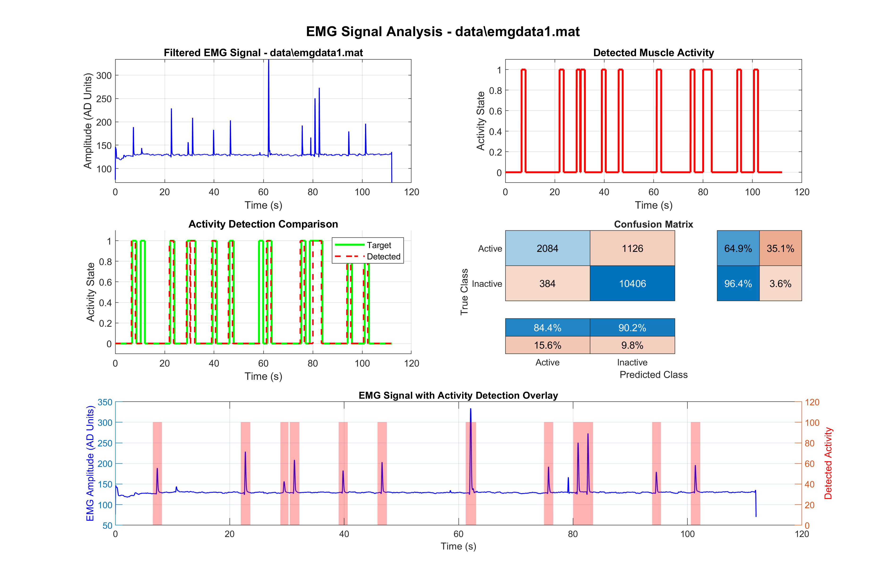

# EMG Signal Processing for Eye Blink Detection


A MATLAB-based system for detecting eye blinks from EMG signals, designed for assistive communication devices.

## Overview

This project provides a robust framework for processing electromyography (EMG) signals to accurately detect eye blink patterns. The system is particularly suited for assistive technology applications where reliable blink detection is essential for communication interfaces.

## Features

- 🚀 **Adaptive Thresholding**  
  Intelligent baseline adjustment for reliable blink detection across varying signal conditions

- 📊 **Performance Metrics**  
  Comprehensive evaluation with accuracy, precision, recall, and F1-score calculations

- 📈 **Visualisation**  
  Automatic generation of signal plots and confusion matrices for analysis

- 🔄 **Batch Processing**  
  Simultaneous processing of multiple datasets for efficient analysis

- 📁 **Report Generation**  
  Results saved in `.mat` and `.txt` formats for further analysis and documentation

## Quick Start

### Prerequisites

**Software Requirements:**
- **MATLAB R2018b** (minimum) or **R2020a+** (recommended)

**Required Toolboxes:**
- [Signal Processing Toolbox](https://www.mathworks.com/products/signal.html) (for `lowpass()` function)
- [Statistics and Machine Learning Toolbox](https://www.mathworks.com/products/statistics.html) (for `confusionmat`/`confusionchart` functions)

### Installation

1. **Clone the repository** and add it to your MATLAB path:
   ```matlab
   !git clone https://github.com/AdzCoder/EMG-Eye-Blink-Detector.git
   addpath(genpath('EMG-Eye-Blink-Detector'));
   ```

2. **Prepare your data** by creating a data folder and adding your EMG datasets:
   ```matlab
   mkdir('data')
   % Place your .mat files (emgdata1.mat to emgdata6.mat) inside the 'data' folder
   ```

### Usage

**Single Dataset Analysis:**
Process a single dataset with visualisation enabled:
```matlab
[activity, accuracy, cm] = emg_signal_processor('data/emgdata1.mat', true);
```

**Batch Processing:**
Process all datasets simultaneously:
```matlab
run_emg_analysis;
```

## Output Examples

The system generates comprehensive analysis outputs including:

- **Filtered EMG Signal Plots:** Visual representation of processed signals with detected activity overlay
  - Example: [`plots/emgdata1_analysis.png`](plots/emgdata1_analysis.png)
  
  

- **Performance Reports:** Confusion matrices and statistical metrics saved alongside data files
- **Analysis Results:** Detailed `.mat` and `.txt` files containing processed data and performance metrics

## Data Format

Input files should be MATLAB `.mat` files containing EMG signal data. The system expects datasets named `emgdata1.mat` through `emgdata6.mat` for batch processing, though individual files can be processed using custom filenames.

## Algorithm Overview

The detection system employs:
1. **Signal Preprocessing:** Low-pass filtering to remove noise and artefacts
2. **Adaptive Thresholding:** Dynamic baseline adjustment based on signal characteristics
3. **Blink Detection:** Pattern recognition for eye blink identification
4. **Performance Evaluation:** Statistical analysis of detection accuracy

## Project Information

**Development Team:** Group 10  
**Institution:** University of Warwick, School of Engineering  
**Module:** [ES197: Systems Modelling, Simulation and Computation (2022/23)](https://courses.warwick.ac.uk/modules/2022/ES197-15)

## Project Status

This project was developed as part of a coursework assignment and is provided for educational purposes. The codebase is feature-complete but not actively maintained.

## Contributing

As this is an educational project, contributions are not actively sought. However, if you find this code useful for your research or studies, feel free to fork and adapt it for your needs.

## Licence

MIT Licence — see the [LICENCE](LICENSE) file for details.

---

*For questions or issues related to this educational project, please refer to the original coursework documentation or contact the development team through appropriate academic channels.*
