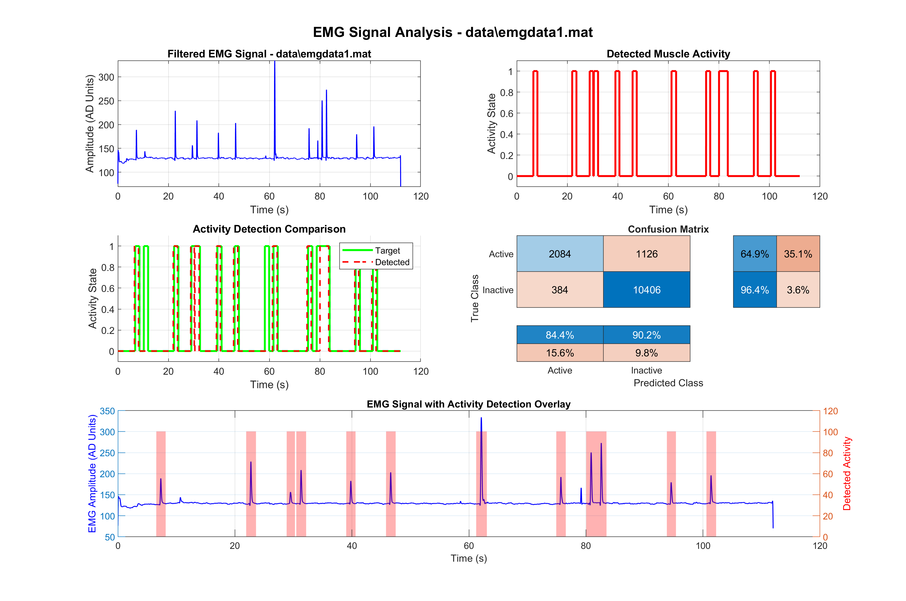

# EMG Eye-Blink Detector

[](https://www.mathworks.com/products/matlab.html)
[](LICENSE)
[](https://warwick.ac.uk/)
[](https://github.com/topics/education)

MATLAB code that detects eye blinks in electromyography (EMG) signals and turns them into a clean on/off activity signal. The intended use is assistive communication: giving someone with severe motor impairment a reliable muscle-driven switch. This repository holds the signal-processing implementation, refactored from the original coursework scripts into a reusable function with batch processing and performance reporting.

## Background

This was the ES197 Systems Modelling, Simulation and Computation project (2022/23), a group brief to design and test an eye-blink detector from EMG data in MATLAB. The motivation is conditions such as Locked-In syndrome, where a small residual muscle movement may be someone's only means of communication. The brief supplied six EMG recordings (each a 14,000-sample vector from a single subject) and asked for a pipeline that recalibrates the time axis, low-pass filters the noisy signal, outputs a 0/1 blink vector against time, and reports precision, recall, and accuracy, with a target accuracy of at least 87%. This repository is the refactored implementation of that pipeline.

## How it works

Each signal is low-pass filtered to strip high-frequency noise, then scanned with a sliding window. Within each window the algorithm compares the local mean and peak against an adaptive baseline (the median of a wider surrounding window); when both exceed their thresholds the window is marked as an active blink. Marking against a rolling baseline rather than a fixed one keeps detection stable as the signal drifts. Where a target signal is available, the code produces a confusion matrix and reports accuracy, precision, recall, and F1.

## Requirements

- **MATLAB** R2018b or later
- **Signal Processing Toolbox** (for `lowpass`)
- **Statistics and Machine Learning Toolbox** (for `confusionmat` / `confusionchart`)

## Usage

Clone the repository and add it to your MATLAB path. Place the EMG datasets (`emgdata1.mat` to `emgdata6.mat`) in a `data/` folder.

```matlab
% Single dataset, with plots
[activity, accuracy, cm] = emg_signal_processor('data/emgdata1.mat', true);

% All datasets at once
run_emg_analysis;
```

Each dataset produces a filtered-signal plot with the detected activity overlaid, a confusion matrix, and the accuracy metrics. Example output is in [`plots/`](plots/).



## Data format

Input files are `.mat` files containing the EMG signal vector, and optionally a `target` vector for scoring. Batch processing expects the names `emgdata1.mat` through `emgdata6.mat`; individual files can use any name.

## Repository layout

- `emg_signal_processor.m`: the detection function
- `run_emg_analysis.m`: batch driver over the `data/` folder
- `data/`: EMG datasets
- `plots/`: generated analysis figures

## Academic context

**Module:** [ES197 Systems Modelling, Simulation and Computation (2022/23)](https://courses.warwick.ac.uk/modules/2022/ES197-15) · **Team:** Group 10 · **Institution:** University of Warwick, School of Engineering

The project is complete and provided as an educational reference. Feel free to fork and adapt it.

## Licence

MIT Licence: see the [LICENCE](LICENSE) file for details.

---

*Developed by Adil Wahab Bhatti as part of academic coursework at the University of Warwick.*
